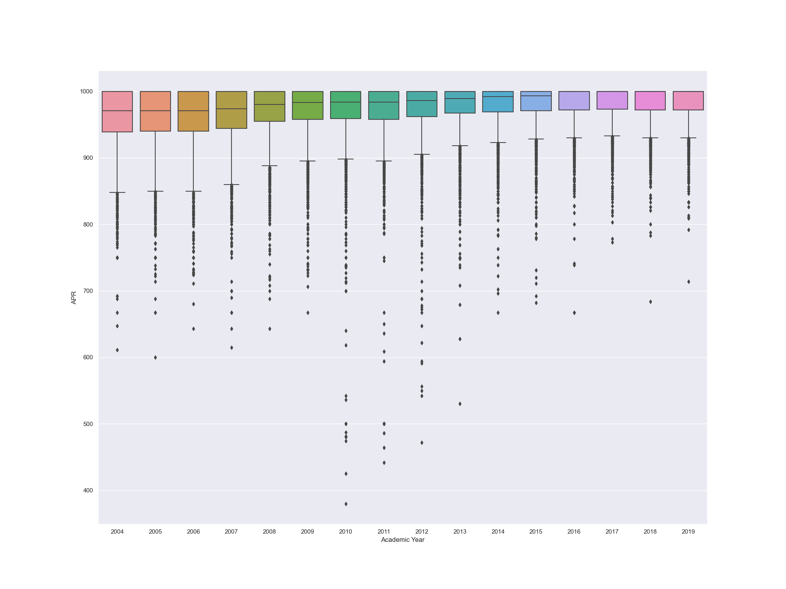

# DS5110
 
## Document for reproducibility
you should open your VSCode and click on : 'File' -> 'Open Folder' -> Select the target folder -> run the main.py on VSCode
## Reproducible results
After run the main.py on VSCode, you can see there are 4 png files in the current folder : Relplot_Question1.png(Visualization for question1),Boxplot_Question1.png(Visualization for question1),Lineplot_Questino2.png(Visualization for question2), boxplot_Questino3_female.png(Visualization for question3), boxplot_Question3_male(Visualization for question3)

### Question 0 
For the sake of DRY principle, the generation of plots for each questions are in Question1.py, Question2.py, Question3.py, respectively.

### Question 1
As for question 1, I genarated 2 plots to analyze our data(boxlot and relplot)

 

From the boxplot and relplot that we generated, we can see that the most outliers happenned from 2010 to 2012. This may be attributed to the Changes in the student-athlete population: The student-athlete population may have changed during this time period, for example, the institution may have started recruiting more student-athletes from underprivileged backgrounds or from less academically-prepared high schools. And the APRs from a wide range of institutions have gone up and only a few outliers were generated since 2012. To some extent, Improved compliance with NCAA policies(The NCAA may have increased its enforcement of APR regulations since 2012, which could have led to more teams achieving higher APR scores and fewer outliers on the boxplot) may be the cause of it.

### Question 2
I used lineplot() to analyze question 2, which seems more straightforward.

From the lineplot, we can safely reach the conclusion that APRs of Females' sports are always higher than those of Males. This might be due to that Female student-athletes may have a stronger focus on academics and a greater commitment to academic success. And also APRs of all genders are gradually. From my point of view, One possible reason for the gradual increase in APRs in NCAA sports of all genders from 2004 to 2019 could be the increased emphasis and focus on academic performance and accountability within college sports programs. The NCAA introduced the APR in 2004 as a way to measure the academic progress and success of student-athletes, and since then, many schools and programs have implemented stricter academic policies and initiatives to improve their APR scores. Additionally, the NCAA has implemented penalties for teams with low APR scores, which may have also motivated schools to prioritize academics more. Another possible reason could be the increased focus on student-athlete welfare and well-being, which includes academic success as a key component

### Question3
I used boxplot() to analyze question 3, which seems more straightforward.

+ Male:

In general, APRs of Men's sports are going up chronologically. And APRs of Men's basketball are not clustered compared to other sports. One possible reason is that basketball is one of the most popular sports in the states and hence more athletes are involved which gives a rise to the clustered APRs. And also, we can find that APRs of Men's swimming are clusterred on the chart, showing relatively higher performance. One possible explanation could be that there is a relatively small number of teams and/or a high degree of consistency in performance among those teams.

+ Female: 

In general, APRs of Men's sports are going up chronologically. Women's bowling has a wide range of scattering on the plot. This could be due to factors such as the level of resources available to the teams, the academic support provided to the student-athletes, or the overall academic performance of the student-athletes on the teams.